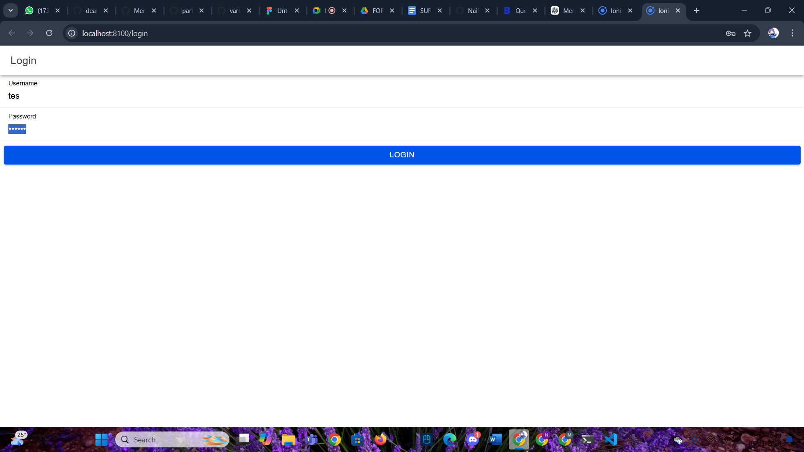
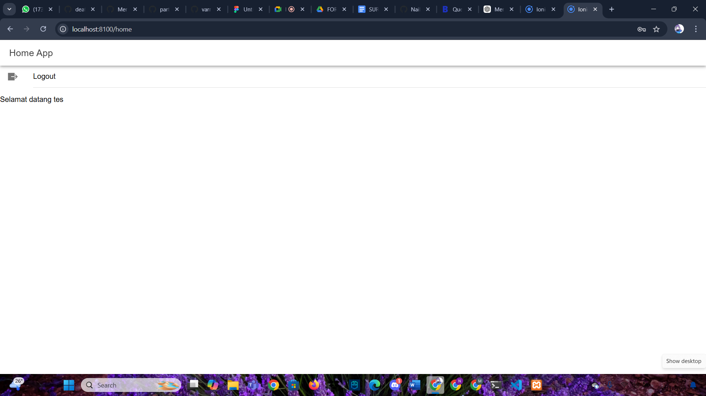

Pertama-tama perlu dibuat sebuah database bernama coba-ionic, yang akan menyimpan data pengguna. Dalam database ini, terdapat tabel user yang terdiri dari kolom username dan password. Kolom password ini disarankan untuk dienkripsi menggunakan metode hash MD5, sehingga informasi sensitif tidak disimpan dalam bentuk asli.

Selanjutnya, file koneksi.php dibuat untuk menangani koneksi antara aplikasi dan database MySQL. File ini berperan penting dalam memastikan aplikasi memiliki akses yang diperlukan ke database, dengan informasi koneksi seperti hostname, username, dan password yang disimpan di sini.

Sementara itu, file login.php bertugas menerima data autentikasi yang dikirim oleh pengguna, yaitu username dan password, melalui php://input. File ini akan memverifikasi apakah data yang diterima sesuai dengan informasi yang tersimpan di dalam tabel user. Jika data cocok, login akan dianggap berhasil dan sistem akan mengirimkan token autentikasi sebagai tanda bukti pengguna yang sah. Namun, apabila data tidak cocok, login akan gagal, dan pengguna tidak akan menerima token autentikasi.

Dalam pengembangan frontend dengan Ionic dan Angular, langkah pertama adalah membuat proyek baru menggunakan perintah `ionic start`, kemudian memasang modul-modul yang diperlukan untuk mendukung fungsionalitas aplikasi. Pada aplikasi ini, halaman login terletak di `app/login/login.page.html` dan berisi formulir dengan input untuk username dan password. File `login.page.ts` mengimplementasikan fungsi `login()` yang bertugas mengirim data ke API melalui `AuthenticationService`. 

`AuthenticationService` dikelola dalam file `authentication.service.ts`, yang menangani autentikasi pengguna, penyimpanan token pada Preferences, dan pemantauan status login menggunakan `BehaviorSubject`. Beberapa metode penting dalam layanan ini adalah `postMethod()` untuk mengirim data ke API, `saveData()` untuk menyimpan token serta username pengguna, dan `logout()` yang menghapus data sesi dan memperbarui status autentikasi menjadi `false`.

Untuk keamanan akses halaman, proteksi rute menggunakan Guards diterapkan. `Auth Guard` (`auth.guard.ts`) memastikan bahwa rute tertentu hanya bisa diakses oleh pengguna yang sudah login, sementara `Auto-Login Guard` (`auto-login.guard.ts`) mengarahkan pengguna yang sudah autentikasi secara otomatis ke halaman utama (home). File `app-routing.module.ts` kemudian mengatur rute-rute dalam aplikasi, di mana halaman `home` dijaga oleh `authGuard`, dan halaman `login` dilindungi oleh `autoLoginGuard`, sehingga pengguna yang telah login diarahkan langsung ke `home`.

Alur login dimulai ketika pengguna mengisi formulir dengan username dan password. Setelah itu, fungsi `login()` mengirim data ini ke `login.php`. Jika API memberikan respons sukses, data pengguna disimpan, dan mereka diarahkan ke halaman utama (home). Namun, jika login tidak berhasil, pengguna akan menerima notifikasi tentang kesalahan yang terjadi.

